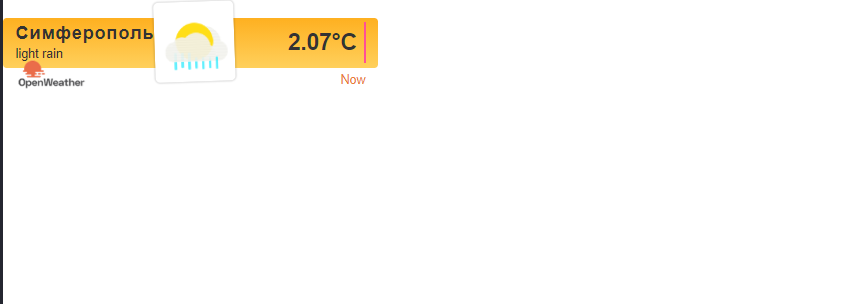

<p align="center">МИНИСТЕРСТВО НАУКИ  И ВЫСШЕГО ОБРАЗОВАНИЯ РОССИЙСКОЙ ФЕДЕРАЦИИ<br>
Федеральное государственное автономное образовательное учреждение высшего образования<br>
"КРЫМСКИЙ ФЕДЕРАЛЬНЫЙ УНИВЕРСИТЕТ им. В. И. ВЕРНАДСКОГО"<br>
ФИЗИКО-ТЕХНИЧЕСКИЙ ИНСТИТУТ<br>
Кафедра компьютерной инженерии и моделирования</p>
<br>
<h3 align="center">Отчёт по лабораторной работе № 1<br> по дисциплине "Программирование"</h3>
<br><br>
<p>студента 1 курса группы ПИ-б-о-202(1)<br>
Нестеренко Никиты Сергеевича<br>
направления подготовки 09.03.04 "Программная инженерия"</p>
<br><br>
<table>
<tr><td>Научный руководитель<br> старший преподаватель кафедры<br> компьютерной инженерии и моделирования</td>
<td>(оценка)</td>
<td>Чабанов В.В.</td>
</tr>
</table>
<br><br>
<p align="center">Симферополь, 2020</p>
<hr>

## Цель:

1. Закрепить навыки разработки многофайловыx приложений;
2. Изучить способы работы с API web-сервиса;
3. Изучить процесс сериализации/десериализации данных в/из json;
4. Получить базовое представление о сетевом взаимодействии приложений;

## Постановка задачи
Разработать сервис предоставляющий данные о погоде в городе Симферополе на момент запроса. 
В качестве источника данных о погоде использовать: http://openweathermap.org/. 
В состав сервиса входит: серверное приложение на языке С++ и клиентское приложение на языке Python. 
Серверное приложение (далее Сервер) предназначенное для обслуживания клиентских приложений и минимизации количества запросов к сервису openweathermap.org. 
Сервер должен обеспечивать возможность получения данных в формате JSON и виде html виджета (для вставки виджета на страницу будет использоваться iframe). 
Клиентское приложение должно иметь графический интерфейс отображающий сведения о погоде и возможность обновления данных по требованию пользователя.

## Выполнение работы

1.Для начала был зарегистрирован аккаунт openwheatermap.org. API ключ по-умолчанию созданный сервисом: e77a594c893b3114f6e35c0c3aab4509.

 

Затем были произведены несколько тестовых запросов, чтобы убедиться, что они не имеют ошибок и вывод правилен.

Запрос, созданный к серверу погоды включает в себя широту и долготу места, для которого необходимо получить погоду, исключить все типы прогноза кроме почасового, ключ API, метрические единицы изменения (цельсий) и описание на русском языке:

api.openweathermap.org/data/2.5/onecall?lat=45.0522222222&lon=33.9744444444&exclude=current,minutely,daily,alerts&appid=e77a594c893b3114f6e35c0c3aab4509&units=metric&lang=ru

Запрос для сервера погоды включает в себя город, время которого необходимо получить:

http://api.openweathermap.org/data/2.5/weather?q=Simferopol&appid=e77a594c893b3114f6e35c0c3aab4509
                                                Рис.1 Аккаунт openwheatermap.org


```

2.Подготовка к работе с сервисом worldtimeapi.org.

Сервис позволяет получить время в формате json. Составим запрос для получения времени в Симферополе и изучите формат ответа: http://worldtimeapi.org/pages/schema.

3.Подготовка серверного приложения.

Для работы с сетью используем библиотеку: https://github.com/yhirose/cpp-httplib.

Клонируем  в виде архива репозиторий библиотеки https://github.com/yhirose/cpp-httplib;

Создаем консольный C++ проект;

Перейдем в папку с главным .cpp файлом проекта и создайте папку include. В ней будут размещаться заголовочные файлы библиотек.

В папке include создаем папку cpp_httplib и скопируем туда файл httplib.h из скаченного ранее репозитория.

Перейдем в свойства проекта. Справа в разделе Дополнительные каталоги включаемых файлов добавим путь к каталогу include;

Скопируем и вставим в главный .cpp файл  код под назаванием "Server": 

```cpp
#include <iostream>
#include <cpp_httplib/httplib.h>
using namespace httplib;
 
// В этой функции формируем ответ сервера на запрос
void gen_response(const Request& req, Response& res) {
  // Команда set_content задаёт ответ сервера и тип ответа:
  // Hello, World! - тело ответа
  // text/plain - MIME тип ответа (в данном случае обычный текст)
  res.set_content("Hello, World!", "text/plain");
}
 
int main(){
  Server svr;                    // Создаём сервер (пока-что не запущен)
  svr.Get("/", gen_response);    // Вызвать функцию gen_response если кто-то обратиться к корню "сайта"
  std::cout << "Start server... OK\n";
  svr.listen("localhost", 1234); // Запускаем сервер на localhost и порту 1234
}
```
                                            Рис.2 Код "Server"

Запустим программу и перейдем по ссылке: http://localhost:1234/. Мы видем сообщение  "Hello, World!"


В этом примере я отправляю get-запрос по адресу http://worldtimeapi.org/api/timezone/Europe/Simferopol. 



                                            Рис.3  Get-запрос

Изучаем алгоритм работы серверного приложения.Создаем свой собственный сервер.

Исходный код MyServer: 

```cpp 
#include <iostream>
#include <string>
#include <cpp_httplib/httplib.h>
#include <nlohmann/json.hpp>

using json = nlohmann::json;
using namespace httplib;
using namespace std;


long get_time (){
    // Создаём клиент и привязываем к домену. Туда пойдут наши запросы
    Client cli("http://worldtimeapi.org");
    // Отправляем get-запрос и ждём ответ, который сохраняется в переменной res
    auto res = cli.Get("/api/timezone/Europe/Simferopol");
    // res преобразуется в true, если запрос-ответ прошли без ошибок
    if (res) {
        // Проверяем статус ответа, т.к. может быть 404 и другие
        if (res->status == 200) {
            // В res->body лежит string с ответом сервера
            std::string body = res->body;
            std::cout << body << std::endl;
            json j = json::parse(body);
            return j["unixtime"].get<long>() ;
        }
        else {
            std::cout << "Status code: " << res->status << std::endl;
        }
    }
    else {
        auto err = res.error();
        std::cout << "Error code: " << err << std::endl;
    }
}

json get_weather() {
    // Создаём клиент и привязываем к домену. Туда пойдут наши запросы
    Client cli("http://api.openweathermap.org");
    // Отправляем get-запрос и ждём ответ, который сохраняется в переменной res
    auto res = cli.Get("/data/2.5/weather?q=Simferopol&appid=e77a594c893b3114f6e35c0c3aab4509");
    // res преобразуется в true, если запрос-ответ прошли без ошибок
    if (res) {
        // Проверяем статус ответа, т.к. может быть 404 и другие
        if (res->status == 200) {
            // В res->body лежит string с ответом сервера
            std::string body = res->body;
            std::cout << body << std::endl;
            json j = json::parse(body);
            return j;
        }
        else {
            std::cout << "Status code: " << res->status << std::endl;
        }
    }
    else {
        auto err = res.error();
        std::cout << "Error code: " << err << std::endl;
    }
}


void gen_response(const Request& req, Response& res) {

    ifstream fin("tep.html");
    string str;
    getline(fin, str, '\0');
    cout << str;
	res.set_content(str, "text/html");
}
void gen_response_raw(const Request& req, Response& res) {
    long t = get_time();
    json w = get_weather();
    res.set_content(w.dump(), "text/json");
}

int main() {
	Server svr;                    // Создаём сервер (пока-что не запущен)
	svr.Get("/", gen_response);
    svr.Get("/raw", gen_response_raw);     // Вызвать функцию gen_response если кто-то обратиться к корню "сайта"
	std::cout << "Start server... OK\n";
	svr.listen("localhost", 3000); // Запускаем сервер на localhost и порту 3000
}
```
                                             Рис.4 Сервер

Запускаем сервер и перейдя по ссылке http://localhost:3000/ мы получим желаемый результат. 


Для проверки  приходит ли  запрос на "/raw", сервер формирует и отправляет json.

4.Подготовка клиентского приложения.

Графический интерфейс реализуйте при помощи Tkinter стандартного модуля Python. 

Для выполнения лабораторной работы достаточно будет использовать  умения базового создания текстовых меток, компоновки виджетов и привязки событий мышки.

Исходный код клиента: 
```python
from tkinter import *
import requests
import json
 
url0 = "http://api.openweathermap.org/data/2.5/weather?q=Simferopol&units=metric&appid=e77a594c893b3114f6e35c0c3aab4509"


def change(event):
    load()


def load():
    # load weather
    # data = {"name":"Simf","weather":"Cloudy","temp":10}
    response = requests.get(url0)
    data = response.json()
    city['text'] = data["name"]
    weather['text'] = data["weather"][0]["main"]
    t = data["main"]["temp"] 
    # add +
    temp['text'] = "{}℃".format(t)
 
 
root = Tk()

city = Label(text="City",
                width=50, height=5)
city.pack()
weather = Label(text="-",
                width=50, height=5)
weather.pack()
temp = Label(text="-", 
             width=50, height=10, 
             bg='black', fg='white')
temp.pack()

load()

root.bind('<Button-1>', change)

root.mainloop()
```
                                         Рис.5 Клиент

Запустив программу мы сможем увидеть:


                                   Рис.6 Программа на питоне

## 5.Туннель.

Скачаем программу и распакуем ее  в любое место.

Запустим. Откроется окно командной строки.Где мы вводим команду: ngrok.exe http 3000

Когда программа запустится по ссылке указанной в Forwarding наш сервер будет доступен из интернета.

Мы можем видеть статистику по запросам проходящим через туннель. 


                                         Рис.7 Туннель

## 6.Вывод.
 
Цель работы была успешно достигнута. Было выполнено:

Создание сервера на языке С++, обращающегося к openweathermap.com и возвращающий виджет или описание и температуру в формате json.

Приложение с графическим интерфейсом, написанное на языке Python с использованием библиотеки Tkinter, получающее и обрабатывающее данные из сервера.


