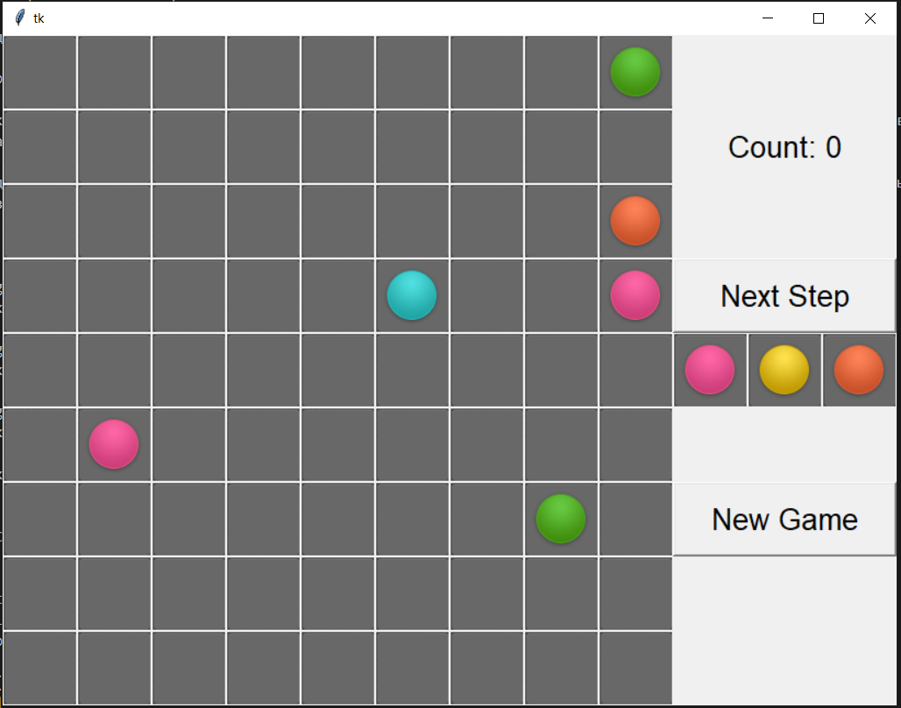
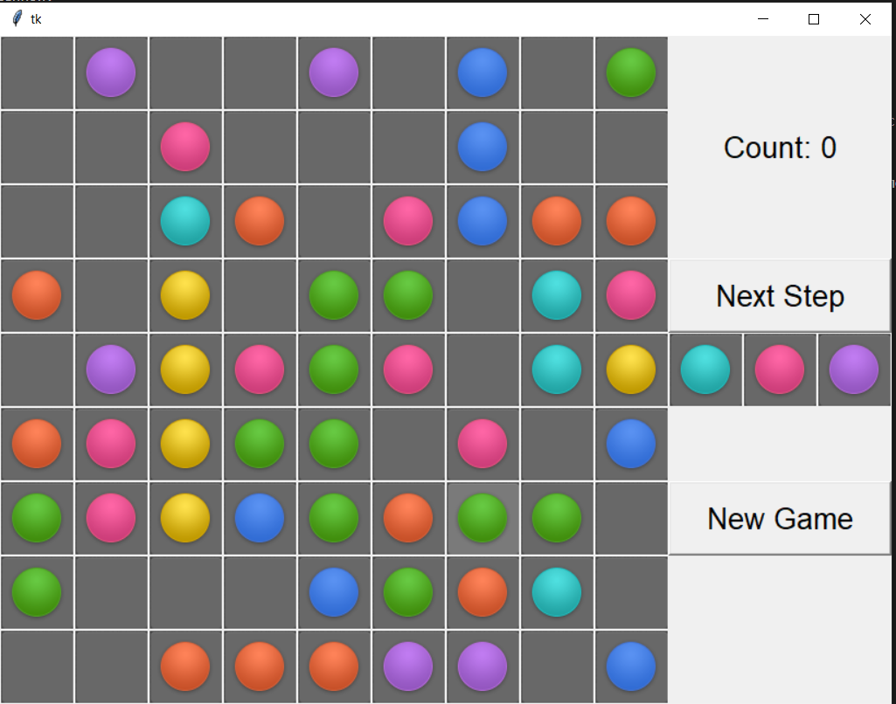
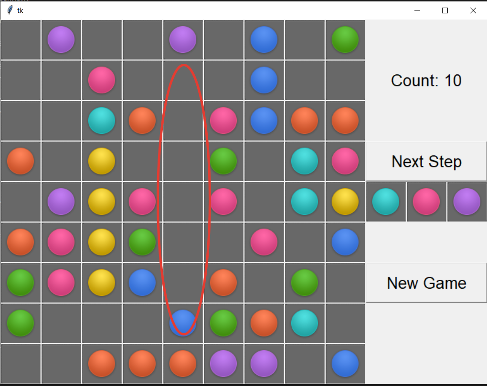
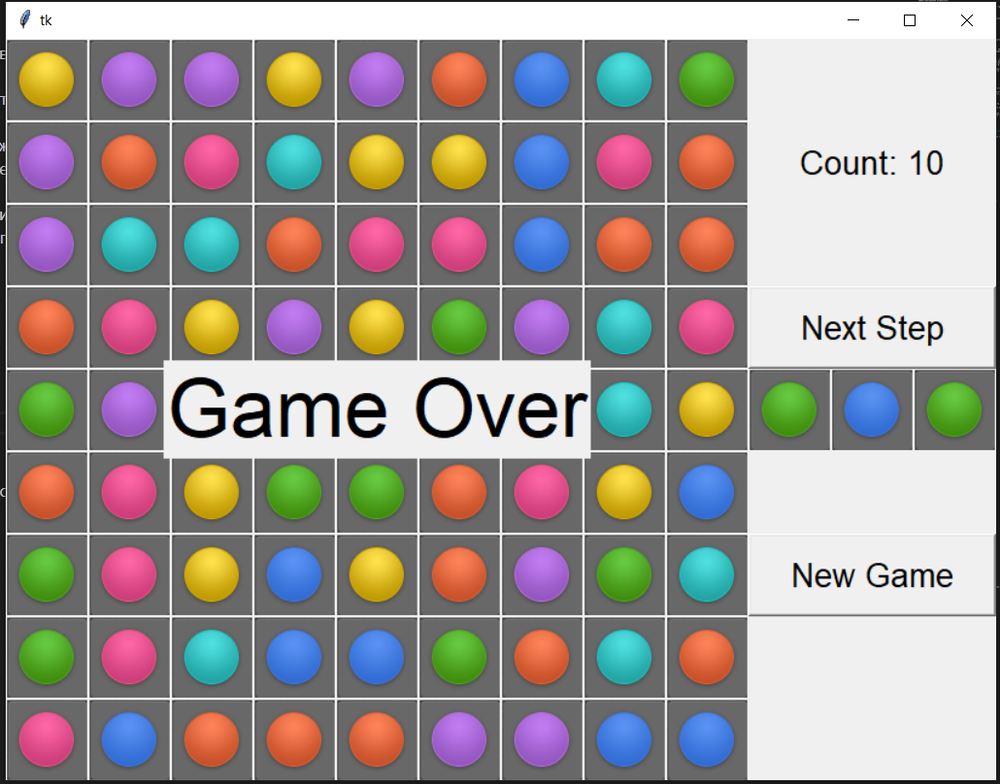

МИНИСТЕРСТВО НАУКИ  И ВЫСШЕГО ОБРАЗОВАНИЯ РОССИЙСКОЙ ФЕДЕРАЦИИ 
Федеральное государственное автономное образовательное учреждение высшего образования 
"КРЫМСКИЙ ФЕДЕРАЛЬНЫЙ УНИВЕРСИТЕТ им. В. И. ВЕРНАДСКОГО" 
ФИЗИКО-ТЕХНИЧЕСКИЙ ИНСТИТУТ 
Кафедра компьютерной инженерии и моделирования

 
<h3 align="center">Отчёт по лабораторной работе № 3  по дисциплине "Программирование"</h3>
  

студента 1 курса группы ПИ-б-о-202(1) Нестеренко Никиты Сергеевич 
направления подготовки 09.03.04 "Программная инженерия"

  
<table>
<tr><td>Научный руководитель  старший преподаватель кафедры  компьютерной инженерии и моделирования</td>
<td>(оценка)</td>
<td>Чабанов В.В.</td>
</tr>
</table>
  

Симферополь, 2020

## Цель

1. Закрепить навыки разработки программ с простым графическим интерфейсом пользователя на зыке Python при помощи библиотеки Tkinter;
2. Получить представление о разработке простых игровых приложений.

## Постановка задачи

1. Используя стандартный модуль для разработки программ с графическим интерфейсом Tkinter реализуйте игру Lines на зыке Python.
2. В качестве образца графического интерфейса использована [данная игра](http://game-shariki.ru/linii-2).

## Выполнение работы

В самом начале была задача сделать игровое поле, которое можно легко редактировать в реальном времени.
В первый раз игра была реализована с помощью класса Label, у которой имеется изображение клетки с
наложенным сверху шариком, однако столкнувшись с проблемой создания текста без своего фона в правой части,
было решено сделать один объект Canvas, помещённый в корневой frame, на котором и производятся все изменения.

Каждая клетка являвется экземпляром класса, который хранит цвет, размер и состояние, выбрана ли клетка и id объекта на canvas.
У каждого объекта есть функция, которая для неё генерирует новую картинку на основе полей экземпляра и
заменяет картинку на Canvas по уникальному id объекта.

Далее были реализованы надписи справа:
- название игры
- счёт
- подсказка
- кнопки "сделать ход" и "новая игра"

Для счёта запоминался id текста, который должен содержать текущий счёт (целое число) и по этому id изменялся счёт через функцию update_score().

Были реализованы функции генерации 3 случайных шариков самого большого размера (подсказки), которые помещались в специальный глобальный буфер, а так же
функция, которая перемещала шарики из буфера на игровое поле. Если нельзя разместить все шарики или после размещения шариков не оставалось пустых
клеток, то игра считается завершённой.

Кнопка "сделать ход" размещает шары из подсказки и генерирует новую.

Кнопка "новая игра" очищает поле, генерирует подсказку, размещает подсказку и снова её генерирует. Игра считается не завершённой.

При попытке перемещения клетки вызывается функция проверки, а можно ли из исходной клетки добраться до цели. Реализован алгоритм BFS (поиска в ширину),
заимствованный из ресурса GeeksForGeeks и переделанный под данное приложение.

После каждого хода делается проверка на 5 и более одинаковых шариков в ряд, столбец и диагональ, и за каждый удалённый шарик добавляется по 2 очка.
Это реализованно через массивы из массивов из ссылок на клетки игрового поля по вертикали, горизонтали и диагонали.

Скриншоты игрового процесса:

   
     Рисунок 1. Игра "Шарики"

   
     Рисунок 2. Игрок удалил ряд из зеленых шаров 

   
     Рисунок 3. Игрок проиграл 

Исходный код на Python: [Pyton.py](Pyton/Pyton/Pyton.py)

## Вывод
Я продвинулся в своём знании Python и Tkinter, научился работать с объектами Canvas, Label, Button, создании классов и созданию простейших игр.